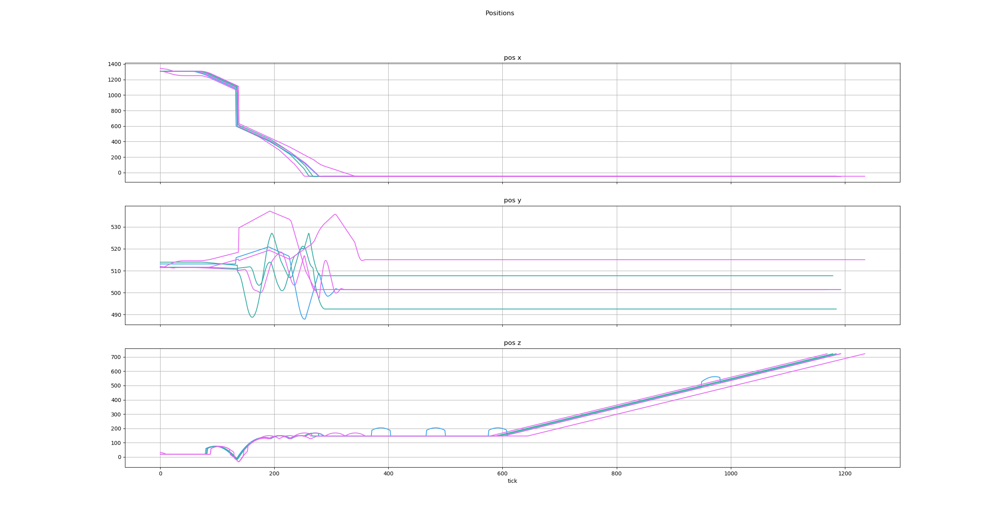

# Demo Overlay Renderer
A program for rendering player positions over images of levels using Source demos.

## Setup
**Warning - this project is bad, it's kind of a pain to set up and was made when I was just started programming, don't use it.** I plan on improving and remaking this in the next 50 years, but until then...

With that out of the way, here's how to setup the project: The project runs on java 12 (I think), and uses on [processing v3.5.3](https://processing.org/download/). If you use IntelliJ, go to file > project structure > libraries, and add everything from processing/core/library. Don't ask me what to do if you don't use IntelliJ. I would highly recommened excluding the render output directory from indexing or using a render directory outside the project folder. Otherwise your IntelliJ (idk if other IDE's do this) will create an overwhelming amount of cache for the output images.

There are two parts - the image calibration and the overlay rendering.
To create images:
1) Load your map and fly high above all of the map geometry, and run `crosshair 0; cl_showpos 0; r_drawviewmodel 0`.
2) Run `camortho`, this will turn on the orthographic camera and I think cannot be disabled without a game restart.
3) Set cl_pitchup/cl_pitchdown to 89.999, and setang 90 0 0. (You can also do side views).
4) Adjust c_orthoheight and c_orthowidth and your position until you see the entire map (the values will probably be on the order of 500-10000 and it's fine if they're different).
5) Take a screenshot, and convert it to a png. (All included images are in `img/level/top` and `img/level/side`).
6) Reload the game, and find two easily identifiable points in your image that are as far diagonally apart as possible. Get the coordinates of those two points and set the pos/pos2 strings in ImageCalibrator.java. (When you get the coordinates, make sure you're in first person mode and use the coordinates of the player origin).
7) Run ImageCalibrator, and slide the yellow/purple circles over your two points (you can pan and zoom), make sure these circles are placed as accurately as possible as this calibration will determine the quality of any renders you make. There will be 4 other circles, make sure you select the one that corresponds to 0,0,0. When done, press the enter key (you should see "saved" text).
This completes the image calibration process, and only has to be done once per image. If your calibration is not good enough, you can rerun it multiple times on the same image to recalibrate it.

To create renders of overlays, adjust the variables in Main.java accordingly and run it.
- demoPath/imgPath/renderOutputFolder - self-explanatory
- host_framerate - this has the same meaning as it does in game. Set this to 0 if you just want to view the result, so it to x if you want to render sequences that are x fps
- render - determines whether or not to render
- textSetting - display the demo name, player name, etc.
- interpType - determines how to interpolate angles/pos

If you set render to false (then make sure to set host_framerate to 0), you should be able to use the arrow keys to control time (but you won't be able to pan/zoom). To set player images, download them to `img/icons/players` as png's. When you run Main.java with demos that don't have player images, you can copy the name of the player from the console output and rename the corresponding image to that.

To generate graphs there's a python script in "src/python_utils" which uses matplotlib & seaborn.

Known issues:
- Viewing the overlay in the display window does not work properly if you have a smaller display than the screenshot size. All current screenshots in the project were done on a 1440p monitor, so you might need to scale and recalibrate the images if you wanted to view the result on a smaller monitor. The rendered images should still be fine though.
