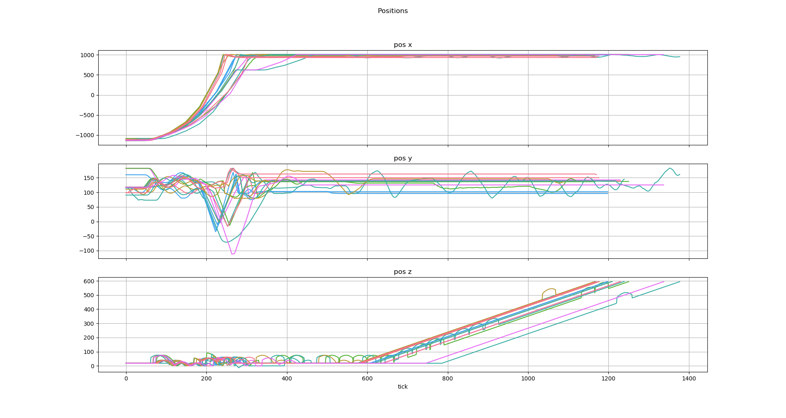

# SourceDemoOverlayRendering
WIP

A program for rendering player positions over images of levels using Source demos. 
Currently this will only display the locations of player 1 from the demo.
Eventually I will add real instructions on how to use this, for now here's a gif and a picture of what can be generated using this project:

To run this you will need Java 12, (I think, idk how java versions work anymore) and processing (v. 3.5.3).
That can be found here: https://processing.org/download/

To generate graphs there's a python script in "resource/pos and vel grapher.py" which uses matplotlib & seaborn.
The whole project relies on "resource/UncraftedDemoParse.exe" which is a different project that I have been working on https://github.com/UncraftedName/UncraftedDemoParser

If cloning this project, I would highly recommened excluding the render output directory from indexing or using a render directory outside the project folder. Otherwise your IntelliJ (idk if other IDE's do this) will create an overwhelming amount of cache from the output images.
